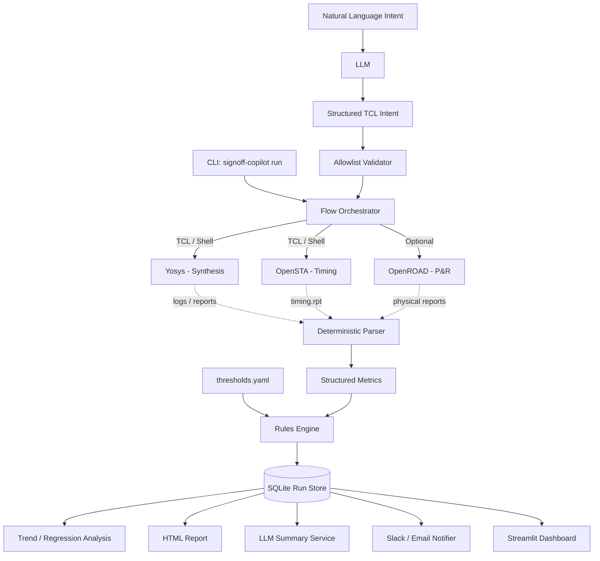

# 🔬 SignOff Copilot

> **AI-assisted EDA flow automation for RTL-to-timing analysis** — run an open-source RTL-to-STA flow with one command, extract structured metrics from tool reports, apply deterministic pass/fail rules, track historical runs, generate signoff-style reports, and use an LLM for natural-language insights and safe TCL generation.

[](https://www.python.org/)
[](LICENSE)
[](https://skywater-pdk.readthedocs.io/)
[](https://github.com/psf/black)

---

## 🎯 Why SignOff Copilot?

EDA regression runs produce large amounts of synthesis, timing, and physical-design output. Engineers repeatedly have to search logs, collect metrics, decide whether a run passed, compare it with previous runs, and write a short status update.

**SignOff Copilot turns that repetitive workflow into a reusable EDA infrastructure pipeline.** The design intentionally separates deterministic engineering logic from AI-generated explanations:

- **Deterministic layer:** executes the flow, parses reports, stores metrics, and makes the pass/fail decision from explicit YAML thresholds.
- **AI layer:** explains the already-validated results in plain English and converts constrained natural-language intents into safe TCL commands.

> **Important:** this project provides **signoff-style automation and reporting around an open-source flow**. It is not a replacement for production foundry signoff methodology or commercial signoff tools.


## 🏗️ System Architecture



---

## ✨ Key Capabilities

### 1. One-command EDA orchestration

Run synthesis and timing analysis without manually stepping through individual tools:

```bash
signoff-copilot run --design picorv32 --clock-period 4.0 --open-report
```

The orchestrator coordinates the flow, captures logs/reports, parses metrics, evaluates thresholds, persists the run, generates the report, and optionally invokes the AI summary layer.

### 2. Deterministic log and report parsing

The parser converts raw EDA output into structured data such as:

- WNS / TNS
- setup and hold violations
- cell count / area
- utilization
- DRC-related metrics when available
- flow runtime

Parsing is deterministic and testable; an LLM is not used to decide whether a metric passes.

### 3. Explicit, reproducible pass/fail rules

Thresholds live outside the code in `config/thresholds.yaml`:

```yaml
thresholds:
  wns_ns_min: 0.0
  tns_ns_min: 0.0
  max_timing_violations: 0
  max_drc_violations: 0
  max_utilization_pct: 85.0
```

This keeps the signoff criteria transparent, version-controlled, and reproducible.

### 4. Run history and regression tracking

Each run is stored in SQLite so results can be compared across iterations instead of being treated as isolated logs.

```text
Run N-1  ─┐
          ├─> historical metrics ─> regression detection ─> trend view
Run N    ─┘
```

This makes the tool useful for repeated IP/RTL regressions rather than only for one-off experiments.

### 5. AI run summaries

The LLM receives the structured run data and selected report excerpts and produces a concise engineering summary, for example:

> Timing failed because setup slack crossed the configured limit, with the worst path becoming substantially more negative than the previous run. Check the reported critical path and recent synthesis/constraint changes first.

The AI explains validated results; it does not replace the deterministic timing analysis or pass/fail rules.

### 6. Natural-language to safe TCL

Example:

```bash
signoff-copilot ask "set the clock period to 5ns"
```

The flow is intentionally constrained:

```text
Natural language
      ↓
     LLM
      ↓
Structured intent
      ↓
Allowlist / validation
      ↓
Approved TCL
      ↓
Flow execution
```

Arbitrary generated code is not executed with `eval` or `exec`.

### 7. Dashboard and notifications

A Streamlit dashboard visualizes historical WNS/TNS/area trends, while optional Slack/SMTP integrations can publish the generated report and AI summary after a run completes.

---

## 🔧 Technology Stack

| Layer | Technologies |
|---|---|
| Flow automation | Python, TCL, shell |
| Synthesis | Yosys |
| Timing | OpenSTA |
| Physical design | OpenROAD (optional) |
| PDK | Sky130 |
| Data store | SQLite |
| Reporting | HTML / Jinja2 |
| Dashboard | Streamlit |
| AI | OpenAI-compatible LLM API |
| Testing | Pytest |

---

## 🚀 Getting Started

### Prerequisites

You need Python 3.9+ and the open-source EDA tools.

**macOS**

```bash
brew install yosys opensta
```

**Linux**

```bash
sudo apt install yosys
```

OpenSTA can be installed through a suitable package, Conda environment, Docker image, or from source.

For Sky130, [Volare](https://github.com/efabless/volare) is recommended:

```bash
pip install volare
volare enable --pdk sky130 latest
export SIGNOFF_PDK_ROOT=$HOME/.volare/sky130A
```

### Install

```bash
git clone https://github.com/karann0077/SignOff-Copilot.git
cd SignOff-Copilot

python -m venv .venv
source .venv/bin/activate
pip install -e ".[dashboard]"
```

### Optional AI configuration

```bash
export OPENAI_API_KEY="your_api_key_here"
```

The LLM layer is optional; deterministic EDA parsing and reporting should remain usable without it.

---

## 💻 Usage

### Full regression run

```bash
signoff-copilot run --design picorv32 --clock-period 4.0 --open-report
```

### Historical runs / reports

```bash
signoff-copilot list --limit 10
signoff-copilot report <RUN_ID>
```

### Dashboard

```bash
signoff-copilot dashboard
```

### Natural-language EDA command

```bash
signoff-copilot ask "set input delay to 0.5ns on all inputs"
```

---

## 📁 Repository Structure

```text
SignOff-Copilot/
├── config/
│   ├── thresholds.yaml
│   └── tools.yaml
├── designs/
│   └── picorv32/
│       ├── rtl/
│       ├── constraints.sdc
│       ├── synth.ys
│       └── sta.tcl
├── dashboard/
│   └── app.py
├── src/signoff_copilot/
│   ├── cli.py
│   ├── orchestrator.py
│   ├── parser.py
│   ├── rules_engine.py
│   ├── datastore.py
│   ├── report_generator.py
│   ├── llm_summary.py
│   ├── nl_to_tcl.py
│   └── notifier.py
├── tests/
│   ├── sample_logs/
│   ├── test_parser.py
│   ├── test_rules_engine.py
│   └── test_datastore.py
└── pyproject.toml
```

---

## 🧪 Testing

The tests use static EDA log/report fixtures, so the parser, rules engine, and datastore can be exercised without having the EDA binaries installed.

```bash
pip install pytest pytest-cov
pytest tests/ -v
```

---

## 🛡️ Safety Model for NL-to-TCL

LLMs can hallucinate commands, so the `ask` path does not directly execute arbitrary model output.

Generated commands are checked against explicit allowed patterns before execution. A command that fails validation is rejected and logged rather than executed.

This keeps the AI feature as a constrained interface on top of the EDA flow instead of giving the model unrestricted shell/TCL access.

---

## 🎓 Why this project is EDA-focused

SignOff Copilot is designed as **EDA infrastructure**, not simply as an AI chatbot:

```text
EDA tools
   ↓
Automation
   ↓
Structured data
   ↓
Deterministic analysis
   ↓
Regression history
   ↓
Engineering report
   ↓
AI-assisted explanation / interaction
```

That combination targets the practical overlap of **design automation, infrastructure, data analytics, and AI-enabled EDA flows**.

---

## 📜 License

This project is licensed under the MIT License — see [LICENSE](LICENSE).

*Note: the `picorv32` RTL used as the demonstration payload is licensed under the MIT License by Clifford Wolf.*
