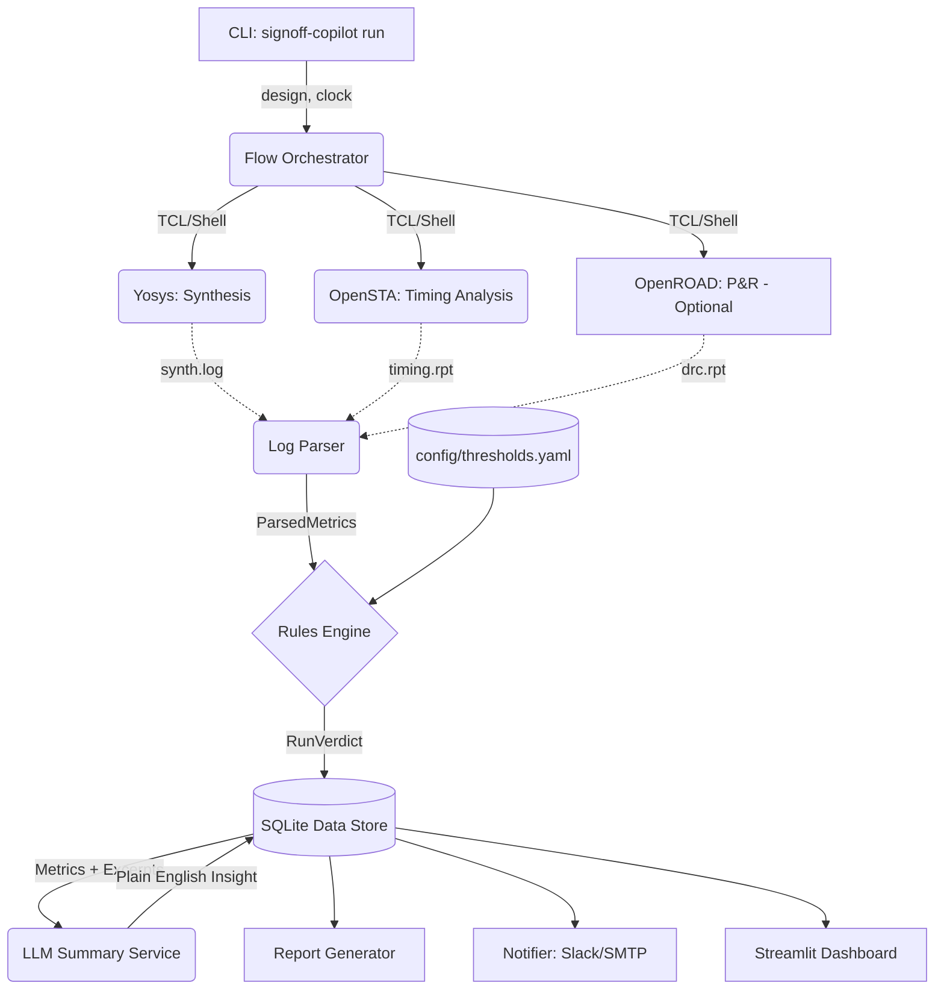

# 🔬 SignOff Copilot: AI-Assisted RTL-to-Timing EDA Automation

> **Next-Generation EDA Signoff** — Automates Yosys → OpenSTA flows end-to-end, extracts structured metrics, enforces deterministic pass/fail rules, and leverages LLMs for natural-language run summaries and TCL command generation.

[](https://www.python.org)
[](LICENSE)
[](https://skywater-pdk.readthedocs.io)
[](https://github.com/psf/black)

---

## 📖 The Problem & The Solution

Every IC design regression run generates thousands of lines of raw synthesis and timing log text. Hardware engineers waste countless hours parsing these logs just to answer: *Did the block pass? If not, why?*

**SignOff Copilot** solves this by separating the workflow into two strict layers:
1. **Deterministic Layer (Trust):** Orchestrates the EDA flow, parses logs deterministically via regex/line-matching, and enforces pass/fail rules strictly based on YAML thresholds. No ML models dictate your signoff.
2. **AI Layer (Insight & Productivity):** Uses LLMs to translate the deterministic verdict into a concise, human-readable summary, and features an **NL-to-TCL** engine to translate plain-English debugging intents into actionable, safe TCL commands.

## 🏗️ System Architecture



## ✨ Key Features

- 🔄 **One-Command Orchestration:** `signoff-copilot run` handles the entire synthesis to STA flow automatically.
- 📊 **Rule-Based Parsing & Thresholds:** Extracts WNS, TNS, cell counts, and violations. Applies `thresholds.yaml` to guarantee a 100% reproducible pass/fail verdict.
- 🤖 **AI Run Summaries:** Automatically generates a 2-4 sentence executive summary of the run and suggests the first debugging step if timing fails.
- 💬 **NL-to-TCL Engine:** Type `"set the clock period to 5ns"` and the LLM translates it into `create_clock -period 5.0 [get_ports clk]`. Output is rigorously checked against a regex allowlist before execution.
- 📈 **Trend Dashboard:** Built-in Streamlit app tracks WNS, TNS, and area metrics over time.
- 🔔 **Webhooks:** Push HTML reports and AI summaries directly to Slack or Email.

---

## 🚀 Getting Started

### 1. Prerequisites
You need Python 3.9+ and the open-source EDA tools.
* **macOS:** `brew install yosys opensta`
* **Linux:** `sudo apt install yosys` (OpenSTA must be built or installed via conda/docker).
* **PDK:** [Volare](https://github.com/efabless/volare) is recommended for installing the Sky130 PDK.
  ```bash
  pip install volare
  volare enable --pdk sky130 latest
  export SIGNOFF_PDK_ROOT=$HOME/.volare/sky130A
  ```

### 2. Installation
```bash
git clone https://github.com/karann0077/SignOff-Copilot.git
cd SignOff-Copilot

# Create a virtual environment and install the package
python -m venv .venv
source .venv/bin/activate
pip install -e ".[dashboard]"
```

### 3. Environment Setup (Optional but recommended)
Set your LLM API key for AI summaries and NL-to-TCL features. The tool defaults to OpenAI-compatible endpoints (works with OpenAI, Groq, Together, etc.).
```bash
export OPENAI_API_KEY="your_api_key_here"
```

---

## 💻 Usage Guide

### Full Regression Run
Run the built-in `picorv32` RISC-V core through synthesis and timing:
```bash
signoff-copilot run --design picorv32 --clock-period 4.0 --open-report
```
*This will execute Yosys and OpenSTA, parse the logs, consult the rules engine, query the LLM for a summary, save the data to SQLite, and open the HTML report in your browser.*

### Data & Trend Dashboard
Launch the Streamlit app to view historical run data and timing closure trends:
```bash
signoff-copilot dashboard
```

### Natural Language to TCL (Ask)
Use the AI to translate your intent into safe TCL:
```bash
signoff-copilot ask "set input delay to 0.5ns on all inputs"
```
*(The generated command is strictly vetted against an allowlist before execution to prevent arbitrary code execution).*

### List & View Past Runs
```bash
signoff-copilot list --limit 10
signoff-copilot report <RUN_ID>
```

---

## ⚙️ Configuration Reference

### Pass/Fail Thresholds (`config/thresholds.yaml`)
Control exact signoff criteria without touching code:
```yaml
thresholds:
  wns_ns_min: 0.0          # Worst Negative Slack (0 = no setup violations)
  tns_ns_min: 0.0          # Total Negative Slack
  max_timing_violations: 0 # Maximum allowed violating paths
  max_drc_violations: 0    # Physical verification limits
  max_utilization_pct: 85.0
```

### Tool Configuration (`config/tools.yaml`)
Define paths to your EDA binaries if they are not in your `$PATH`, and set your PDK root.

---

## 🧪 Testing
The test suite utilizes static log fixtures, meaning **you can run the tests without having EDA tools installed.**
```bash
pip install pytest pytest-cov
pytest tests/ -v
```

---

## 🛡️ Safety Model (NL-to-TCL)
The `ask` module translates natural language to TCL. Because LLMs can hallucinate, SignOff Copilot employs a strict, regex-based allowlist. The output is **never** passed to `eval` or `exec`. It is evaluated against patterns like `create_clock -period \d+\.\d+ \[get_ports \w+\]`. If it doesn't perfectly match an allowed pattern, execution is blocked and logged.

---

## 📜 License
This project is licensed under the MIT License - see the [LICENSE](LICENSE) file for details. 
*Note: The `picorv32` RTL used as a demonstration payload is licensed under the MIT License by Clifford Wolf.*
