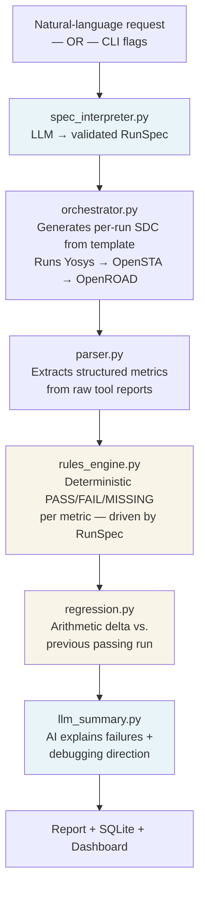

# 🔬 SignOff Copilot

> **AI-assisted RTL debugging and signoff copilot** — describe your signoff requirements in plain English, have them translated into a validated structured specification, run a real open-source EDA flow, get deterministic pass/fail results, automatic regression detection against previous runs, and a debugging-focused AI explanation of exactly what went wrong and where to look.

[](https://www.python.org/)
[](LICENSE)
[](https://skywater-pdk.readthedocs.io/)
[](tests/)
[](https://github.com/psf/black)

---

## 🎯 What Problem This Solves

Every EDA regression run produces hundreds of lines of raw synthesis, timing, and DRC output. An engineer has to manually read it to answer:

1. *Did it pass?*
2. *If not, why — and is it a regression?*
3. *Where should I start debugging?*

**SignOff Copilot automates all three.** The engineer describes what they want to check in plain English. The system translates that into validated checks, runs the real EDA tools, evaluates the results deterministically, compares against previous runs arithmetically, and uses an LLM only to explain the failure and suggest a concrete first debugging step.

> **Important:** SignOff Copilot is a **debugging and signoff copilot for existing RTL designs**. It is not an RTL generator, autonomous chip designer, or production foundry signoff replacement. It wraps Yosys/OpenSTA and interprets their output.

---

## 🏗️ System Architecture

The system is a strict sequential pipeline. Each stage has a single responsibility.



### The two-layer design principle

| Layer | What it does | Who decides pass/fail |
|---|---|---|
| **Deterministic** | Runs EDA tools, parses logs, applies thresholds, detects regression | **Always this layer** |
| **AI** | Interprets NL request → `RunSpec`; Explains failures and debugging direction | **Never** |

---

## ✨ Capabilities

### 1. Natural-language signoff specification

Describe what to check in a single sentence:

```bash
signoff-copilot analyze \
  --design picorv32 \
  --request "Analyze for 300 MHz. Check setup timing, hold timing,
             area below 25000 um2, utilization below 75%,
             and flag anything that regressed from the last passing run."
```

The system extracts a fully typed `RunSpec` from the request. Unsupported requirements (anything the EDA flow cannot measure, such as power or IR drop) are surfaced explicitly — never silently ignored or fabricated as PASS.

**Supported requirements in natural language:**
- Clock frequency / period
- WNS, TNS, setup timing violations
- Hold timing violations (separately tracked)
- Chip area (µm²), cell count, utilization (%)
- DRC violations
- Input/output delay, clock uncertainty, clock latency
- Regression comparison against any previous run

### 2. Validated `RunSpec` — single source of truth

All requirements from NL or CLI flags flow through a single typed Python dataclass called `RunSpec`. Nothing downstream reads a YAML file or a hardcoded threshold. Every check is:
- **requested** (a threshold was set) → evaluated, `MISSING` if not measured
- **not requested** (threshold is `None`) → skipped entirely
- **unsupported** (flow cannot measure it) → surfaced as `UNSUPPORTED`, not PASS

### 3. Dynamic EDA constraint generation

When you request a 300 MHz analysis, the system **generates a new `constraints_runtime.sdc`** with the correct clock period, I/O delays, and uncertainty substituted in from the `RunSpec`. The static `constraints.sdc` is no longer used for tool execution — its values cannot get out of sync with what you requested.

### 4. Deterministic pass/fail with meaningful outcomes

The rules engine evaluates every requested check and assigns a precise outcome:

| Outcome | Meaning |
|---|---|
| `PASS` | Measured and meets threshold |
| `FAIL` | Measured and violates threshold |
| `MISSING` | Was requested but metric could not be measured → **run fails** |
| `UNSUPPORTED` | Requested but flow cannot measure it → surfaced in report, never silently PASS |
| `SKIPPED` | Not requested in RunSpec → not evaluated |

A completely failed parse (all metrics `None`) now correctly produces `FAIL`, not a false green.

### 5. Separated setup and hold timing analysis

Setup violations and hold violations are parsed from separate sections of the OpenSTA report and tracked independently:

```
num_setup_violations   — paths failing the max-delay (setup) check
num_hold_violations    — paths failing the min-delay (hold) check
num_timing_violations  — total (backward-compat property = setup + hold)
```

You can request hold-only, setup-only, or both checks independently.

### 6. Deterministic regression analysis

When you include "compare with the last passing run" in your request, the system:

1. Retrieves the most recent PASS run for the design from SQLite
2. Computes per-metric arithmetic deltas (no LLM involved)
3. Flags each metric as `better` / `worse` / `unchanged` / `new` / `lost`
4. Determines regressions based on metric-appropriate tolerances

Regression detection is purely deterministic. The LLM never makes regression decisions.

### 7. Debugging-focused AI explanation

The LLM receives a fully structured prompt containing:
- Failed requirements with measured values and thresholds
- MISSING metric details
- Per-metric regression deltas with direction
- Worst timing path excerpt from the OpenSTA report
- UNSUPPORTED requirements (for awareness)

It responds with a 3–6 sentence plain-English explanation: what failed, how severe, whether it is a regression, and **one concrete next debugging step**. It cannot change the pass/fail verdict.

### 8. Run history and dashboard

Every run stores its `RunSpec`, metric verdicts, and regression report as JSON alongside scalar metrics in SQLite. A Streamlit dashboard visualizes historical WNS/TNS/area/utilization trends over time.

### 9. Safe NL-to-TCL translator

```bash
signoff-copilot ask "set the clock period to 5ns and rerun timing"
```

Generated TCL is validated against an explicit regex allowlist before execution. Arbitrary model output is never passed to `eval` or `subprocess.run`.

---

## 🔧 Technology Stack

| Layer | Technology |
|---|---|
| NL specification | OpenAI-compatible LLM (JSON mode, temperature 0) |
| Flow automation | Python `subprocess`, TCL scripts |
| Synthesis | **Yosys** |
| Static timing | **OpenSTA** |
| Physical design | **OpenROAD** (optional `--pnr`) |
| PDK | **Sky130** (Google × SkyWater) |
| Data store | SQLite (with automatic schema migration) |
| Reporting | HTML + Jinja2 |
| Dashboard | Streamlit |
| Testing | Pytest (118 tests, zero EDA tools required) |

---

## 🚀 Getting Started

### Prerequisites

**Python 3.9+** is all you need to run the tests and explore the codebase. The EDA tools (Yosys, OpenSTA) are only required to actually execute an EDA flow.

#### Install EDA tools (only needed to run the flow)

**macOS**
```bash
brew install yosys
# OpenSTA: install via conda, Docker, or build from source
# https://github.com/The-OpenROAD-Project/OpenSTA
```

**Linux (Ubuntu/Debian)**
```bash
sudo apt install yosys
```

#### Install Sky130 PDK (only needed for real EDA runs)

[Volare](https://github.com/efabless/volare) is the recommended installer:

```bash
pip install volare
volare enable --pdk sky130 latest
export SIGNOFF_PDK_ROOT=$HOME/.volare/sky130A
```

### Install SignOff Copilot

```bash
git clone https://github.com/karann0077/SignOff-Copilot.git
cd SignOff-Copilot

python -m venv .venv
source .venv/bin/activate     # Windows: .venv\Scripts\activate

pip install -e ".[dashboard]"
```

### Configure LLM (optional)

The LLM layer is fully optional. Without an API key, the `analyze` command falls back to building a `RunSpec` from YAML defaults, and the AI explanation falls back to a template. All deterministic parsing, evaluation, and regression detection continue to work without any API key.

```bash
# For the NL → RunSpec interpreter and AI explanations:
export OPENAI_API_KEY="sk-..."

# Or use any OpenAI-compatible endpoint (Groq, Gemini, local Ollama):
export LLM_API_KEY="..."
```

---

## 💻 Usage

### Option A — Natural-language interface (recommended)

Describe everything you want to check in one sentence:

```bash
signoff-copilot analyze \
  --design picorv32 \
  --request "Analyze for 250 MHz. Check setup and hold timing.
             Area must be below 20000 um2, utilization below 80%.
             Flag any regression from the last passing run."
```

The system will:
1. Parse the request into a validated `RunSpec` (LLM if key available, YAML defaults otherwise)
2. Surface any unsupported requirements before running
3. Generate a per-run SDC with the correct clock period
4. Run Yosys → OpenSTA
5. Evaluate every requested check with explicit outcomes
6. Compare against the previous PASS run
7. Generate an AI debugging explanation
8. Write an HTML report and save to the database

#### Example with unsupported requirements

```bash
signoff-copilot analyze \
  --design picorv32 \
  --request "Check timing at 300 MHz, area below 25000 um2,
             power below 50mW, and compare with yesterday's run."
```

Output will include:
```
⚠ Unsupported requirements (not measurable by this flow):
    • power below 50mW
```

Power is surfaced explicitly before the run — it never silently becomes PASS.

---

### Option B — Explicit CLI flags (backward compatible)

```bash
# Basic run at 250 MHz
signoff-copilot run --design picorv32 --clock-period 4.0

# With place-and-route (requires OpenROAD)
signoff-copilot run --design picorv32 --clock-period 4.0 --pnr

# Open the HTML report automatically
signoff-copilot run --design picorv32 --clock-period 4.0 --open-report

# Offline (no LLM)
signoff-copilot run --design picorv32 --clock-period 4.0 --no-llm
```

---

### View history and reports

```bash
# List recent runs
signoff-copilot list --limit 10

# Filter by design
signoff-copilot list --design picorv32

# Open a specific run's HTML report
signoff-copilot report <RUN_ID>
```

### Launch the dashboard

```bash
signoff-copilot dashboard
# Opens http://localhost:8501
```

### NL-to-TCL translator

```bash
# Translate a natural-language EDA command to TCL (dry run)
signoff-copilot ask --dry-run "set the clock period to 5ns"

# Translate and execute (validated against allowlist)
signoff-copilot ask "report timing for the top 10 worst paths"
```

---

## 📁 Repository Structure

```text
SignOff-Copilot/
├── config/
│   ├── thresholds.yaml          ← Default signoff thresholds (fallback template)
│   └── tools.yaml               ← EDA binary paths and PDK location
│
├── designs/
│   └── picorv32/
│       ├── rtl/
│       │   └── picorv32.v       ← RISC-V RTL (MIT license, Clifford Wolf)
│       ├── constraints.sdc      ← Human-readable reference (NOT used directly)
│       ├── constraints.sdc.tmpl ← Template: clock/IO delays substituted at runtime
│       ├── synth.ys             ← Yosys synthesis script
│       └── sta.tcl              ← OpenSTA timing script
│
├── src/signoff_copilot/
│   ├── spec_interpreter.py      ← RunSpec dataclass + NL → spec (LLM) + CLI → spec
│   ├── orchestrator.py          ← EDA flow sequencer + per-run SDC generator
│   ├── parser.py                ← Regex-based log parser (setup/hold separated)
│   ├── rules_engine.py          ← Deterministic evaluator (PASS/FAIL/MISSING/UNSUPPORTED)
│   ├── regression.py            ← Arithmetic delta analysis vs. previous run
│   ├── datastore.py             ← SQLite wrapper + schema migration
│   ├── llm_summary.py           ← AI summary + debugging explanation generator
│   ├── report_generator.py      ← HTML report (Jinja2)
│   ├── nl_to_tcl.py             ← Safe NL-to-TCL translator (allowlist validated)
│   ├── notifier.py              ← Slack / SMTP integration
│   ├── cli.py                   ← Click CLI (run, analyze, list, report, ask, dashboard)
│   └── templates/
│       └── report.html.j2
│
├── dashboard/
│   └── app.py                   ← Streamlit historical trends dashboard
│
├── tests/
│   ├── sample_logs/             ← Static EDA log fixtures (no tool install needed)
│   ├── test_parser.py
│   ├── test_rules_engine.py     ← Uses RunSpec; covers MISSING/UNSUPPORTED
│   ├── test_datastore.py
│   ├── test_regression.py       ← 23 tests for arithmetic regression detection
│   ├── test_spec_interpreter.py ← 25 tests for RunSpec creation
│   └── test_nl_to_tcl.py
│
└── pyproject.toml
```

---

## 🧪 Testing

Tests use static fixture logs — **no EDA tools need to be installed** to run them.

```bash
pip install pytest
pytest tests/ -v
```

```
118 passed in 0.19s
```

### What is tested without EDA tools

| Test file | Coverage |
|---|---|
| `test_parser.py` | Regex extraction from real OpenSTA/Yosys fixture logs |
| `test_rules_engine.py` | Every PASS/FAIL/MISSING/UNSUPPORTED boundary; setup/hold separation; area checks |
| `test_spec_interpreter.py` | NL → RunSpec parsing (mocked LLM); CLI flags → RunSpec; clock derivation |
| `test_regression.py` | `_compute_delta` edge cases; regression detection; improvement detection |
| `test_datastore.py` | SQLite insert/retrieve/migration |
| `test_nl_to_tcl.py` | Allowlist validation; safe pattern matching |

---

## 🔁 The Pipeline in Detail

```
Engineer: "Analyze picorv32 at 300 MHz. Area below 25000 um2.
           Compare with the last passing run."
          │
          ▼ spec_interpreter.py  (LLM JSON mode, temperature=0)
   RunSpec {
     design:              "picorv32"
     clock_period_ns:     3.333
     check_setup:         True,   wns_ns_min: 0.0
     check_hold:          True,   max_hold_violations: 0
     max_chip_area_um2:   25000.0
     compare_with_previous: True
   }
          │
          ▼ orchestrator.py
   Generates constraints_runtime.sdc:
     create_clock -name clk -period 3.333 [get_ports clk]
     set_input_delay -clock clk -max 0.5 [all_inputs]
     ...
   Runs: yosys synth.ys → opensta sta.tcl
          │
          ▼ parser.py
   ParsedMetrics {
     wns_ns: -0.082,  tns_ns: -0.41
     num_setup_violations: 2,  num_hold_violations: 0
     cell_count: 3541,  chip_area_um2: 16200.0
   }
          │
          ▼ rules_engine.py  (driven entirely by RunSpec)
   RunVerdict {
     WNS (ns):           FAIL   -0.082 < 0.0 ← VIOLATION
     Setup violations:   FAIL   2 > 0 ← VIOLATION
     Hold violations:    PASS   0 ≤ 0
     Chip area (µm²):    PASS   16200 ≤ 25000
     overall:            FAIL
   }
          │
          ▼ regression.py  (pure arithmetic, no LLM)
   RegressionReport {
     WNS:   0.25 → -0.082  (Δ -0.332)  REGRESSION ↑
     Area:  15800 → 16200  (Δ +400)    REGRESSION ↑
   }
          │
          ▼ llm_summary.generate_debug_explanation()
   "The run failed at 300 MHz due to 2 setup violations with a worst
    negative slack of -0.082 ns, representing a regression from the
    previous WNS of +0.25 ns. The area also grew by 400 µm². Start
    by examining the critical path between the ALU output register
    and the memory write port — this path appeared in the previous
    failing report as well."
```

---

## 🛡️ Safety Model

### NL-to-RunSpec (analyze command)
- LLM receives only the engineer's text and a fixed JSON schema
- Output is deserialized and validated before touching any EDA configuration
- LLM cannot execute shell commands, invoke tools, or modify files
- Unsupported requirements are categorised and surfaced — never executed

### NL-to-TCL (ask command)
- LLM generates a TCL string
- The string is validated against `_SAFE_PATTERNS` (compiled regex allowlist)
- Anything that does not match the allowlist is **rejected before execution**
- No `eval`, no `exec`, no `subprocess.run` on raw LLM output

### Verdict integrity
- The LLM receives the deterministic verdict as an input
- Its system prompt explicitly states it cannot change the verdict
- `FAIL` from the rules engine cannot be overridden to `PASS` by any LLM output

---

## 🎓 Design Philosophy

```
Natural-language request
    │
    ▼  (LLM — schema-constrained interpretation only)
Validated RunSpec  ← single source of truth
    │
    ▼  (deterministic)
EDA execution  →  metric extraction  →  threshold evaluation
    │
    ▼  (deterministic)
Regression detection  (arithmetic deltas)
    │
    ▼  (LLM — explanation only, cannot change verdict)
Plain-English debugging explanation
    │
    ▼
HTML report + SQLite history + Streamlit dashboard
```

The LLM appears at exactly two points in the pipeline. Everything between them is deterministic, reproducible, and testable. This is intentional — an EDA signoff tool must be auditable.

---

## 📜 License

This project is licensed under the MIT License — see [LICENSE](LICENSE).

*The `picorv32` RTL used as the demonstration design is licensed under the MIT License by Clifford Wolf.*

---

## 🙏 Acknowledgements

Built on top of the open-source silicon ecosystem:

- **[Yosys](https://github.com/YosysHQ/yosys)** — open-source synthesis suite (YosysHQ / Claire Wolf)
- **[OpenSTA](https://github.com/The-OpenROAD-Project/OpenSTA)** — static timing analysis (The OpenROAD Project)
- **[OpenROAD](https://github.com/The-OpenROAD-Project/OpenROAD)** — RTL-to-GDS flow (The OpenROAD Project)
- **[Sky130 PDK](https://github.com/google/skywater-pdk)** — open-source process design kit (Google × SkyWater Technology)
- **[PicoRV32](https://github.com/cliffordwolf/picorv32)** — RISC-V processor core used as demo design (Clifford Wolf)
